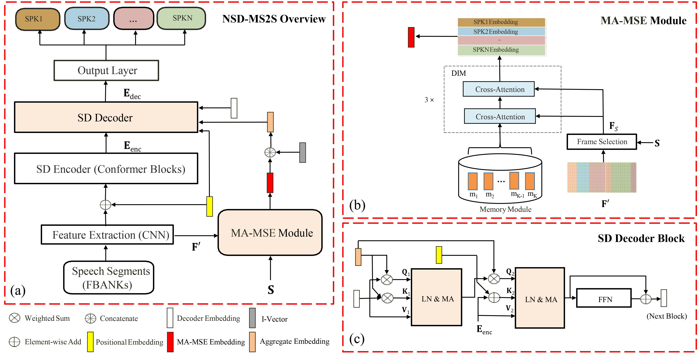
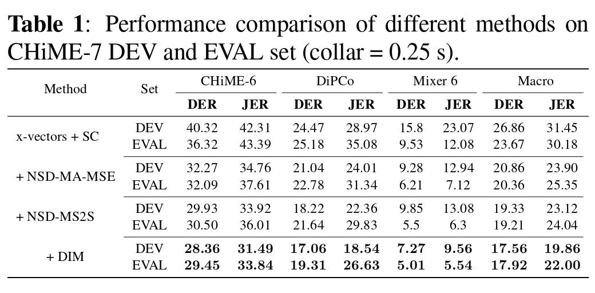

# NSD-MS2S
This repository is an official pytorch implementation of the paper "Neural Speaker Diarization Using Memory-Aware Multi-Speaker Embedding with Sequence-to-Sequence Architecture", for more details please see [paper](doc/ICASS2024.pdf). Our previous work **NSD-MA-MSE** can be found in this [repository](https://github.com/Maokui-He/NSD-MA-MSE), if your training data is not particularly adequate, please prioritize **NSD-MA-MSE**, it usually leads to better results in our experience. Have fun!


## Requirements

```shell
pip install -r requirements.txt
```

## Simple Usage

```
#local/model_S2S_weight_input_DIM.py

from model_S2S_weight_input_DIM import MULTI_MAM_SE_S2S_model
from config import configs3_4Speakers_ivector_ivector128_xvectors128_S2S_MA_MSE_DIM as config_train

net = MULTI_MAM_SE_S2S_model(config_train).cuda()

B = 16
data = torch.randn(B, 40, 800).cuda()  # B, F, T
overall_embedding = torch.randn(B, 4, 100).cuda() # B, N, D1
mask = torch.randint(0, 2, size=(B, 4, 800), dtype=torch.int).cuda() # B, N, T

with torch.no_grad():
    out = net(data, overall_embedding, mask)
print(out.shape)  # B, N, T
```
## Results


## Training
0. Data simulation

We generated simulated data by [https://github.com/jsalt2020-asrdiar/jsalt2020_simulate](https://github.com/jsalt2020-asrdiar/jsalt2020_simulate) for CHiME-7 DASR Challenge, for more details please see our tech report [paper](doc/CHiME_2023_DASR_wang.pdf).

1. Extract fbank

You should use local/extract_feature.sh to extract fbanks and i-vector for training. For example:
```
local/extract_feature.sh --stage 1 --nj $nj \
      --sample_rate _16k --ivector_dir $ivector_dir \
      --max_speaker 4 --affix _$affix \
      --rttm data/$data/diarized.all.rttm --data $data
```

2. After preparing the training data in the format needed for the local/run_MAMSE_S2S_chime7_ws_input_DIM.py, e.g.

```
#local/run_MAMSE_S2S_chime7_ws_input_DIM.py
data="CHiME6MAMSELabel_SimuCHiME6_Mixer6MAMSELabel_SimuMixer6_SimuDipcoDevNoise" # train data name
feature_scp = f"data/{data}/cmn_slide_fbank_htk.list"  # your fbanks list
ivector_path = f"data/{data}/ivectors_spk.txt"    # your i-vector path
oracle_rttm = f"data/{data}/oracle.rttm"          # your oracle.rttm path 
```

 Then simply execute the following command:

```

# 8 GPUs
python -m torch.distributed.launch --nproc_per_node=8 local/run_MAMSE_S2S_chime7_ws_input_DIM.py

```
## Decoding
You can check the decoding results with the following decode commands (Case4 below):

```
# single model decode, it might be a little better compared to the results of the paper.
bash local/decode_S2S_model.sh --stage 3 --data chime7_eval_all_CH --diarized_rttm data/chime7_eval_all_CH/f1.rttm --affix f1

# models fusion decode, there are no results here, just as an example
bash local/decode_S2S_models_fusion.sh --stage 3 --data chime7_eval_all_CH --diarized_rttm data/chime7_eval_all_CH/f1.rttm --affix f1
```
Other usage:

* Case1：
    * local/decode_S2S_model.sh --stage 1 && local/extract_feature.sh --stage **1** (modified in  decode_S2S_model.sh stage 1) indicates the first time you decode one dataset, including generating fbanks for this dataset and extracting the i-vector based on the provided rttm (use clustering or other methods to get), and then decoding it.
* Case2：
  * local/decode_S2S_model.sh --stage 1 && local/extract_feature.sh --stage **3** (modified in  decode_S2S_model.sh stage 1) indicates that you have extracted the fbanks and now have a new initialization rttm to extract the new i-vector and re-decode the dataset.

* Case3: 
  * local/decode_S2S_model.sh --stage 2 denotes the re-decoding based on the existing fbank and i-vector.

* Case4:
  * local/decode_S2S_model.sh --stage 3 indicates that decoding is complete, re-check the decoding result.

Models fusion decoding script (decode_S2S_models_fusion.sh) have similar usage.
## Citation

If you find this code useful in your research, please consider to cite the following papers:

```bibtex
@article{yang2023neural,
  title={Neural Speaker Diarization Using Memory-Aware Multi-Speaker Embedding with Sequence-to-Sequence Architecture},
  author={Yang, Gaobin and He, Maokui and Niu, Shutong and Wang, Ruoyu and Yue, Yanyan and Qian, Shuangqing and Wu, Shilong and Du, Jun and Lee, Chin-Hui},
  journal={arXiv preprint arXiv:2309.09180},
  year={2023}
}

@ARTICLE{10093997,
  author={He, Mao-Kui and Du, Jun and Liu, Qing-Feng and Lee, Chin-Hui},
  journal={IEEE/ACM Transactions on Audio, Speech, and Language Processing}, 
  title={ANSD-MA-MSE: Adaptive Neural Speaker Diarization Using Memory-Aware Multi-Speaker Embedding}, 
  year={2023},
  volume={31},
  number={},
  pages={1561-1573},
  doi={10.1109/TASLP.2023.3265199}}

@inproceedings{seq2seq,
  title={{Target-Speaker Voice Activity Detection via Sequence-to-Sequence Prediction}},
  author={Cheng, Ming and Wang, Weiqing and Zhang, Yucong and Qin, Xiaoyi and Li, Ming},
  booktitle={ICASSP 2023-2023 IEEE International Conference on Acoustics, Speech and Signal Processing (ICASSP)},
  pages={1-5},
  year={2023},
  organization={IEEE}
}
```
